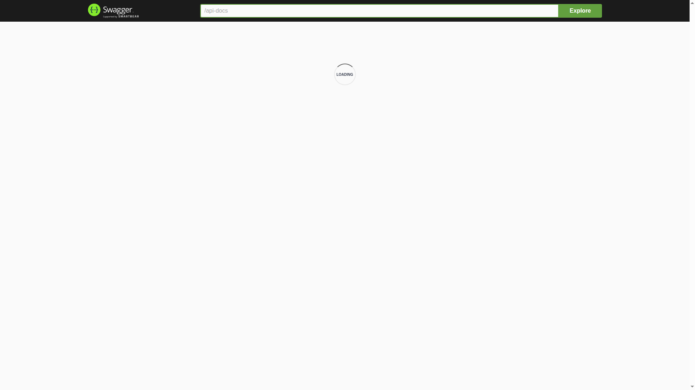

# KYC Compliance Platform

Plateforme de conformité KYC (Know Your Customer) — architecture modulaire Spring Boot 3.5.11.



## Stack

| Technologie | Usage |
|---|---|
| **Java 21** + **Spring Boot 3.5.11** | Backend |
| **Spring Modulith** | Architecture modulaire (5 modules, event-driven) |
| **PostgreSQL 15** + **Flyway** | Base de données & migrations |
| **MinIO** | Stockage de documents (compatible S3) |
| **JWT (jjwt 0.12)** | Authentification stateless |
| **MapStruct + Lombok** | Mapping DTO / réduction boilerplate |
| **Springdoc OpenAPI** | Documentation interactive |
| **Testcontainers** | Tests d'intégration |
| **Docker Compose** | Infrastructure locale |

## Architecture modulaire

```
auth          — Inscription, connexion, JWT
customer      — Profil client
document      — Upload & stockage (MinIO)
verification  — Workflow KYC (soumission → review → approve/reject)
notification  — Emails automatiques (Spring Mail)
```

**Principe** : chaque module expose des events (records Java) et des interfaces de lookup publiques. Aucun accès direct aux `internal` des autres modules.

## Prérequis

- Java 21
- Docker & Docker Compose
- Maven 3.8+ (ou `./mvnw`)

## Lancement

```bash
# 1. Démarrer PostgreSQL + MinIO
docker compose up -d postgres minio

# 2. Lancer l'application
./mvnw spring-boot:run
```

Application accessible sur **http://localhost:8080**.

## Documentation API

| Outil | URL |
|---|---|
| Swagger UI | http://localhost:8080/swagger-ui.html |
| OpenAPI spec | http://localhost:8080/api-docs |

## Endpoints

### Authentification (publique)
| Méthode | Path | Description |
|---|---|---|
| POST | `/api/v1/auth/register` | Inscription |
| POST | `/api/v1/auth/login` | Connexion → JWT |

### Client (ROLE_USER)
| Méthode | Path | Description |
|---|---|---|
| GET | `/api/v1/customers/me` | Profil connecté |
| PUT | `/api/v1/customers/me` | Mettre à jour le profil |

### Documents (ROLE_USER)
| Méthode | Path | Description |
|---|---|---|
| POST | `/api/v1/documents/upload` | Upload (max 20 Mo, PDF/JPEG/PNG) |
| GET | `/api/v1/documents/me` | Mes documents |
| GET | `/api/v1/documents/download/{id}` | Télécharger un document |
| DELETE | `/api/v1/documents/{id}` | Supprimer un document |

### Vérifications KYC
| Méthode | Path | Rôle | Description |
|---|---|---|---|
| POST | `/api/v1/verifications/submit` | USER | Soumettre un dossier |
| GET | `/api/v1/verifications/me` | USER | Mes vérifications |
| GET | `/api/v1/verifications` | ADMIN | Toutes les vérifications |
| GET | `/api/v1/verifications/{id}` | ADMIN | Détail d'une vérification |
| PATCH | `/api/v1/verifications/{id}/review` | ADMIN | Mettre en revue |
| PATCH | `/api/v1/verifications/{id}/approve` | ADMIN | Approuver |
| PATCH | `/api/v1/verifications/{id}/reject` | ADMIN | Rejeter |

### Notifications (ROLE_USER)
| Méthode | Path | Description |
|---|---|---|
| GET | `/api/v1/notifications/me` | Mes notifications |

## Workflow KYC

```
Inscription → Upload documents → Soumission dossier
                                     ↓
                              Review (ADMIN)
                                     ↓
                         ┌────────────┼────────────┐
                         ↓            ↓            ↓
                     Approuvé     En revue      Rejeté
                         ↓                        ↓
                  Notification email      Notification email + raison
```

## Rôles

- **ROLE_USER** — s'inscrit, uploade des documents, soumet des dossiers
- **ROLE_ADMIN** — consulte et traite (review/approve/reject) tous les dossiers

## Variables d'environnement

| Variable | Description | Défaut |
|---|---|---|
| `MAIL_USERNAME` | Utilisateur SMTP | — |
| `MAIL_PASSWORD` | Mot de passe SMTP | — |
| `JWT_SECRET` | Clé secrète JWT (min 256-bit) | `default-secret-key-for-dev` |

## Tests

```bash
./mvnw test
```

Tests d'intégration avec Testcontainers (PostgreSQL) + vérification de modularité Spring Modulith.
